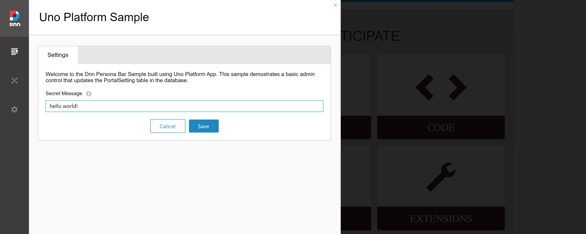
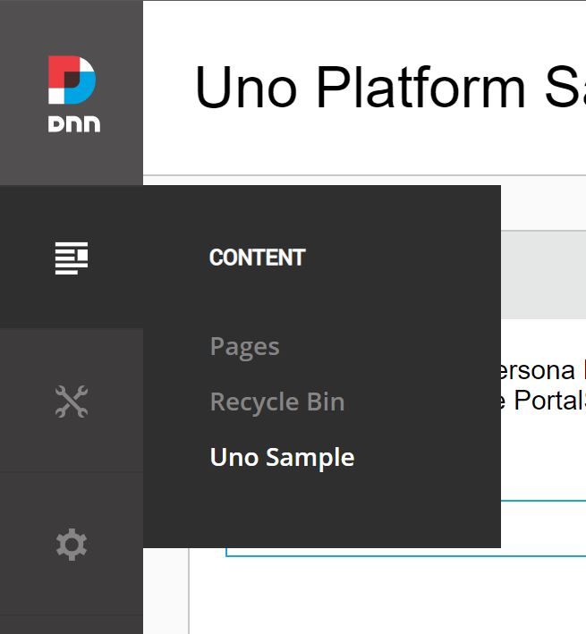

**This project is an experiment and is not currently recommended for building DNN Persona Bar Modules**
The goal of the project is to give definititive advice if this can be used securely, but right now it is just an experiment. Use the code here at your own risk.

# Uno Platform Dnn Persona Bar Module Sample
This is a sample project for integrating Uno Platform's WASM (Web Assembly) target as Dnn (Formerly DotNetNuke) Persona Bar Module.

# Status
Currently this sample project is a proof of concept and there are several manual steps to get this running on a Dnn Site. Take a look at the experiment blog I wrote that will help get you started.
- [Dnn Persona Bar Component Using Uno Platform](https://www.andrewhoefling.com/Blog/Post/dnn-persona-bar-component-using-uno-platform)

# Getting Started
Currently there is no simple getting started steps. Below is a series of steps that should help you get going with the code provided here

1. Create `Dnn.UnoSample` folder in `~/DesktopModules/Admin/Dnn.PersonaBar/Modules` folder on your dnn site
2. Copy over all folders/files from `Dnn.PersonaBar.Uno.Web` to the new `Dnn.UnoSample` folder
3. Build the `Dnn.PersonaBar.Uno.WebApi` project and copy the dlls to the `~/bin` directory on your dnn site
4. Build the `Dnn.PersonaBar.Uno.WASM` project and copy the `dist` folder to the `~/DesktopModules/Admin/Dnn.PersonaBar/Modules/Dnn.UnoSample` folder on your dnn site.
5. Follow the steps from my blog [Dnn Persona Bar Component Using Uno Platform](https://www.andrewhoefling.com/Blog/Post/dnn-persona-bar-component-using-uno-platform) to get your dnn site configured to render the module.

## Troubleshooting
Uno Platform requires several changes to the `web.config` if you are having issues loading your module with script errors, ensure the `web.config` changes have been made.

## Future Getting Started Steps
I plan to put together a cake build script for this project that will create a DNN installer file. Until that is completed, use the getting started guide here and be aware your milage may vary.

# Screenshot

# Created By Andrew Hoefling
This sample was created by [Andrew Hoefling](https://github.com/ahoefling)
- Twitter: [@andrew_hoefling](https://twitter.com/andrew_hoefling)
- Website: [andrewhoefling.com](https://www.andrewhoefling.com/)
